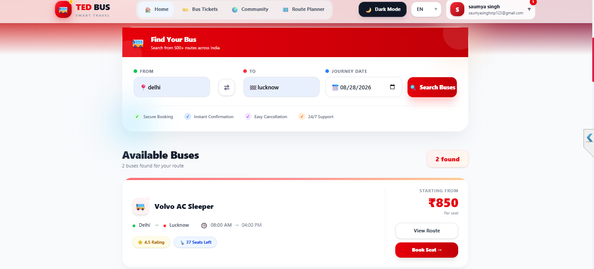
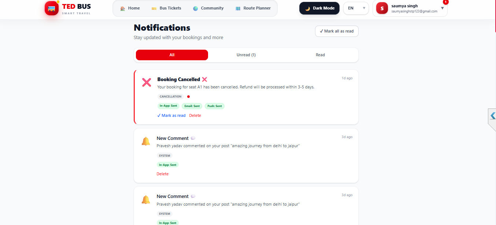
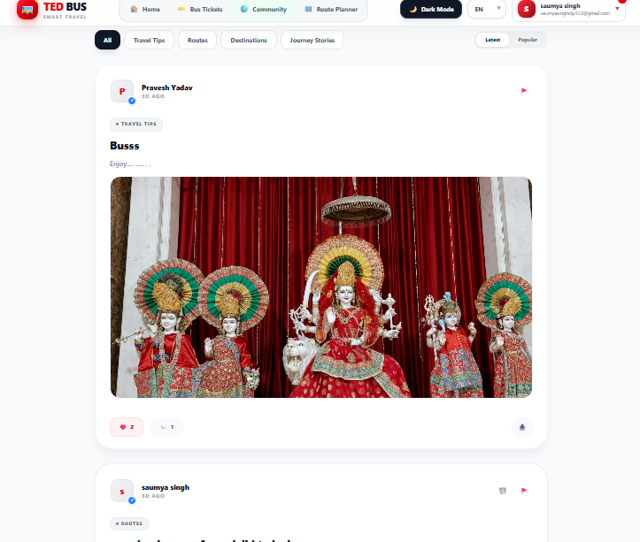

<p align="center">
  
</p>

<div align="center">

# 🚌 TEDBUS

### Smart Bus Ticket Booking & Travel Platform

**Book • Travel • Relax**

A modern full-stack bus ticket booking and travel platform built using the **MEAN Stack — MongoDB, Express.js, Angular and Node.js**.

TedBus provides a complete digital travel experience with bus search, seat selection, passenger management, online payments, digital tickets, real-time notifications, route planning, community features, reviews, offers and an admin dashboard.

<p>
  <a href="https://ted-bus-one.vercel.app/">
    
  </a>
  <a href="https://github.com/saumyachauhanstp123-cloud/TedBus">
    
  </a>
  <a href="https://www.linkedin.com/in/saumya-singh-chauhan-3723b4376/">
    
  </a>
</p>

<p>
  
  
  
  
  
  
</p>

</div>

---

# 🌐 Live Application

| Service                  | Link                                                        |
| ------------------------ | ----------------------------------------------------------- |
| 🚀 **Live Application**  | https://ted-bus-one.vercel.app/                             |
| 💻 **GitHub Repository** | https://github.com/saumyachauhanstp123-cloud/TedBus         |
| 💼 **LinkedIn**          | https://www.linkedin.com/in/saumya-singh-chauhan-3723b4376/ |

---

# ✨ About TedBus

**TedBus** is a full-stack bus ticket booking platform developed using the **MEAN Stack**.

The application is designed to provide users with a complete and convenient travel-booking experience.

Users can:

* 🔍 Search buses
* 🚌 View bus details
* 💺 Select seats
* 👤 Add passenger information
* 💳 Make online payments
* 🎟️ Generate digital tickets
* 📋 Manage bookings
* ⭐ Rate and review buses
* 🔔 Receive real-time notifications
* 🗺️ Plan travel routes
* 💾 Save routes
* 🎁 Apply coupons and offers
* 👥 Participate in community discussions
* 🌙 Use Dark Mode

The platform also includes a powerful **Admin Dashboard** for managing buses, users, bookings, coupons, reviews, reports and community content.

---

# 🎯 Why TedBus?

TedBus goes beyond a basic CRUD application.

It combines multiple real-world full-stack development concepts into a single production-style application:

```text
Authentication
      ↓
Bus Search
      ↓
Seat Management
      ↓
Booking System
      ↓
Payment Gateway
      ↓
Payment Verification
      ↓
Digital Ticket
      ↓
Real-Time Notifications
      ↓
Reviews & Community
      ↓
Route Planning
      ↓
Admin Management
```

---

# 🚀 Core Features

## 🔐 Authentication & Authorization

* JWT-based authentication
* User registration and login
* Email OTP verification
* Forgot password
* Reset password
* Protected routes
* Role-based authorization
* Admin authentication
* Password hashing
* Secure cookies
* Request validation

---

## 🚌 Bus Search & Booking

* Search buses by source and destination
* Travel-date based search
* Bus details
* Bus schedules
* Filters
* Sorting
* Seat availability
* Interactive seat selection
* Passenger information
* Booking summary
* Booking confirmation
* Booking history
* Booking management

---

## 💳 Online Payments

TedBus integrates **Razorpay** for online payment processing.

Features include:

* Payment order creation
* Razorpay checkout
* Payment verification
* Payment records
* Secure payment workflow
* Booking confirmation
* Failed payment handling

---

## 🎟️ Digital Ticket System

After successful payment, users receive access to their digital ticket.

Features:

* Booking details
* Passenger information
* Bus information
* Seat information
* QR code support
* PDF ticket generation
* Booking history

---

## 🔔 Real-Time Notifications

Real-time communication is implemented using **Socket.IO**.

Features:

* Real-time notifications
* Booking notifications
* Payment notifications
* Travel reminders
* Notification preferences
* Scheduled reminder jobs
* Failed notification retry handling

---

## 🗺️ Route Planner

TedBus provides an interactive route-planning experience.

Features:

* Interactive maps
* Route planning
* Source and destination selection
* Travel route information
* Saved routes
* TomTom Maps API integration

---

## 👥 Community Platform

Users can interact and share travel-related information through the community system.

Features:

* Create posts
* Comments
* Replies
* Likes
* Discussions
* Forums
* Save posts
* Report content
* Community moderation

---

## ⭐ Reviews & Ratings

Users can share their experience through:

* Bus ratings
* Reviews
* Feedback
* Review management
* Admin moderation

---

## 🎁 Coupons & Offers

* Discount coupons
* Coupon validation
* Active coupon checking
* Discount management
* Admin coupon management

---

# 🛠️ Admin Dashboard

The Admin Dashboard provides centralized control over the application.

### Admin Features

* 👤 User management
* 🚌 Bus management
* 🎫 Booking management
* 💳 Payment monitoring
* 🎁 Coupon management
* ⭐ Review moderation
* 👥 Community moderation
* 🚨 Report management
* ⚙️ Platform management

---

# 🎨 User Experience

## 🌙 Dark Mode

TedBus supports a persistent dark-mode experience for improved usability and accessibility.

## 📱 Responsive Design

The application is designed for:

```text
💻 Desktop
📱 Mobile
📟 Tablet
```

## 🌍 Internationalization

The application supports multilingual functionality using Angular-compatible internationalization tools and translation architecture.

---

# 🖼️ Application Preview

## 🏠 Home Page

<p align="center">
  
</p>

---

## 🔎 Search Buses

<p align="center">
  
</p>

---

## 🚌 Bus Details

<p align="center">
  
</p>

---

## 💺 Seat Selection

<p align="center">
  
</p>

---

## 🎫 Booking

<p align="center">
  
</p>

---

## 💳 Payment

<p align="center">
  
</p>

---

## 🔔 Notifications

<p align="center">
  
</p>

---

## 🎁 Offers

<p align="center">
  
</p>

---

## 🗺️ Route Planner

<p align="center">
  
</p>

---

## 👥 Community

<p align="center">
  
</p>

---

## 🛠️ Admin Dashboard

<p align="center">
  
</p>

---

# 🧰 Tech Stack

## 🎨 Frontend — Angular

| Technology          | Purpose                            |
| ------------------- | ---------------------------------- |
| Angular             | Frontend Framework                 |
| TypeScript          | Application Development            |
| Angular Router      | Client-side Routing                |
| Angular Services    | Business Logic & API Communication |
| RxJS                | Reactive Programming               |
| Angular Forms       | Form Management & Validation       |
| Angular HTTP Client | REST API Communication             |
| Angular Guards      | Route Protection                   |
| Socket.IO Client    | Real-Time Communication            |
| Razorpay            | Payment Integration                |
| TomTom Maps         | Route Planning                     |
| QR Code             | Digital Ticket                     |
| jsPDF               | PDF Generation                     |

---

## ⚙️ Backend — Node.js & Express.js

| Technology              | Purpose                 |
| ----------------------- | ----------------------- |
| Node.js                 | JavaScript Runtime      |
| Express.js              | REST API Framework      |
| MongoDB Atlas           | Database                |
| Mongoose                | MongoDB ODM             |
| JWT                     | Authentication          |
| bcryptjs                | Password Hashing        |
| Socket.IO               | Real-Time Communication |
| Nodemailer              | Email Services          |
| Cloudinary              | Media Storage           |
| Multer                  | File Upload             |
| Node-Cron               | Scheduled Jobs          |
| Helmet                  | Security Headers        |
| Express Rate Limit      | API Protection          |
| Joi / Express Validator | Request Validation      |
| Razorpay                | Payment Processing      |

---

# 🏗️ MEAN Stack Architecture

```text
                         👤 USER
                           │
                           │ HTTPS
                           ▼
              ┌──────────────────────────┐
              │       🅰️ ANGULAR        │
              │                          │
              │ Angular + TypeScript    │
              │ Components + Services   │
              │ Forms + Routing         │
              └────────────┬─────────────┘
                           │
                    REST API + Socket.IO
                           │
                           ▼
              ┌──────────────────────────┐
              │     ⚙️ EXPRESS.JS       │
              │                          │
              │      Node.js Server     │
              │      REST APIs          │
              └────────────┬─────────────┘
                           │
                           ▼
              ┌──────────────────────────┐
              │       🍃 MONGODB         │
              │                          │
              │      MongoDB Atlas      │
              │      Data Storage       │
              └──────────────────────────┘

                    External Services
                           │
          ┌────────────────┼────────────────┐
          │                │                │
          ▼                ▼                ▼
      💳 Razorpay      🗺️ TomTom       ☁️ Cloudinary
      Payments        Maps API         Media
          │
          ▼
      📧 Nodemailer
      Email Services
```

---

# 🔄 Booking Flow

```text
┌──────────────┐
│  Search Bus  │
└──────┬───────┘
       ↓
┌──────────────┐
│  Select Bus  │
└──────┬───────┘
       ↓
┌──────────────┐
│ Select Seats │
└──────┬───────┘
       ↓
┌─────────────────┐
│ Passenger Info  │
└──────┬──────────┘
       ↓
┌─────────────────┐
│ Booking Summary │
└──────┬──────────┘
       ↓
┌──────────────┐
│  Razorpay 💳 │
└──────┬───────┘
       ↓
┌─────────────────┐
│ Payment Verify  │
└──────┬──────────┘
       ↓
┌────────────────────┐
│ Booking Confirmed  │
└──────┬─────────────┘
       ↓
┌────────────────────┐
│ Digital Ticket 🎟️ │
└────────────────────┘
```

---

# 🗄️ Database Design

TedBus uses **MongoDB Atlas** as its primary database.

### Main Collections

```text
users
│
├── buses
├── bookings
├── payments
├── coupons
├── reviews
│
├── notifications
├── notificationpreferences
│
├── posts
├── comments
├── likes
├── forums
├── discussions
├── replies
├── reports
│
├── routes
├── savedroutes
├── savedposts
│
├── settings
└── otps
```

---

# 🔌 API Architecture

Core API modules:

```text
/api/v1/auth
/api/v1/users
/api/v1/buses
/api/v1/bookings
/api/v1/coupons
/api/v1/admin
/api/v1/reviews
```

Additional modules handle:

```text
🔔 Notifications
💳 Payments
👥 Community
🗺️ Routes
⭐ Reviews
🎁 Coupons
```

---

# 🔐 Security

TedBus implements multiple security practices:

```text
🔒 JWT Authentication
🔑 Password Hashing
🛡️ Helmet Security Headers
🚦 API Rate Limiting
✅ Request Validation
🔐 Protected Routes
🍪 Secure Cookies
🌐 CORS Configuration
```

Sensitive credentials such as database passwords, JWT secrets and payment credentials are stored through environment variables.

---

# ⚙️ Local Installation

## 1️⃣ Clone Repository

```bash
git clone https://github.com/saumyachauhanstp123-cloud/TedBus.git

cd TedBus
```

---

## 2️⃣ Backend Setup

```bash
cd tedbus-backend

npm install

npm run dev
```

Backend:

```text
http://localhost:5000
```

---

## 3️⃣ Angular Frontend Setup

Open another terminal:

```bash
cd tedbus-frontend

npm install

ng serve
```

Frontend:

```text
http://localhost:4200
```

---

# 🔑 Environment Variables

## Backend

```env
PORT=5000

MONGO_URI=*****************

FRONTEND_URL=

JWT_SECRET=

RAZORPAY_KEY_ID=
RAZORPAY_KEY_SECRET=

EMAIL_USER=
EMAIL_PASS=

CLOUDINARY_CLOUD_NAME=
CLOUDINARY_API_KEY=
CLOUDINARY_API_SECRET=
```

## Angular Frontend

```env
API_BASE_URL=

SOCKET_URL=

RAZORPAY_KEY_ID=

TOMTOM_API_KEY=
```

> ⚠️ Never commit real API keys, database credentials, JWT secrets or payment secrets to GitHub.

---

# 🚀 Deployment

TedBus follows a separated frontend and backend deployment architecture.

```text
                         GitHub
                           │
                  ┌────────┴────────┐
                  │                 │
                  ▼                 ▼
               ▲ Vercel          Render
                  │                 │
                  ▼                 ▼
            Angular Frontend    Node + Express
                  │                 │
                  └────────┬────────┘
                           │
                           ▼
                     MongoDB Atlas
```

### Frontend

```text
Vercel
  ↓
Angular
  ↓
ted-bus-one.vercel.app
```

### Backend

```text
Render
  ↓
Node.js + Express.js
  ↓
REST API + Socket.IO
```

### Database

```text
MongoDB Atlas
```

---

# 📊 Project Highlights

<div align="center">

| 🚀 Feature       | ⚡ Technology         |
| ---------------- | -------------------- |
| Frontend         | Angular + TypeScript |
| Architecture     | MEAN Stack           |
| Backend          | Node.js + Express.js |
| Database         | MongoDB Atlas        |
| Authentication   | JWT + OTP            |
| Payments         | Razorpay             |
| Real-Time        | Socket.IO            |
| Maps             | TomTom               |
| Media            | Cloudinary           |
| Email            | Nodemailer           |
| Background Jobs  | Node-Cron            |
| Frontend Hosting | Vercel               |
| Backend Hosting  | Render               |

</div>

---

# 💡 What I Learned

Building TedBus helped me gain practical experience in real-world full-stack development, including:

* MEAN stack architecture
* Angular application development
* TypeScript
* REST API development
* Authentication and authorization
* JWT-based security
* MongoDB schema design
* Mongoose
* Payment gateway integration
* Real-time WebSocket communication
* Email automation
* Scheduled background jobs
* API validation
* Rate limiting
* CORS configuration
* File and media management
* Responsive UI development
* Route planning and map APIs
* Production deployment
* Vercel and Render deployment
* MongoDB Atlas
* Environment-based configuration

---

# 📈 Future Improvements

Potential future enhancements include:

* 🤖 AI-powered travel recommendations
* 📍 Live bus tracking
* 📱 Progressive Web App support
* 🔔 Push notifications
* 💰 Dynamic pricing
* 🎫 Wallet and refund management
* 📊 Advanced analytics dashboard
* 🧠 Personalized travel recommendations
* 🚌 Bus operator management
* 📱 Dedicated mobile application

---

# 👩‍💻 Developer

<div align="center">

## Saumya Singh Chauhan

### Full-Stack Developer | MEAN Stack | Problem Solver

I enjoy building modern, scalable and user-focused web applications using technologies such as **Angular, TypeScript, Node.js, Express.js and MongoDB**.

**TedBus** is a full-stack project focused on solving real-world transportation and ticket-booking problems while implementing modern web-development practices.

<br/>

<a href="https://github.com/saumyachauhanstp123-cloud">

</a>

<a href="https://www.linkedin.com/in/saumya-singh-chauhan-3723b4376/">

</a>

</div>

---

# ⭐ Support the Project

If you like **TedBus**, consider giving the repository a ⭐.

Your support helps motivate continued development and improvement.

<div align="center">

# 🚌 TEDBUS

### Search • Book • Pay • Travel

Built with ❤️ using the **MEAN Stack**

**MongoDB • Express.js • Angular • Node.js**

<br/>

⭐ **Star the repository if you found it useful!** ⭐

</div>
